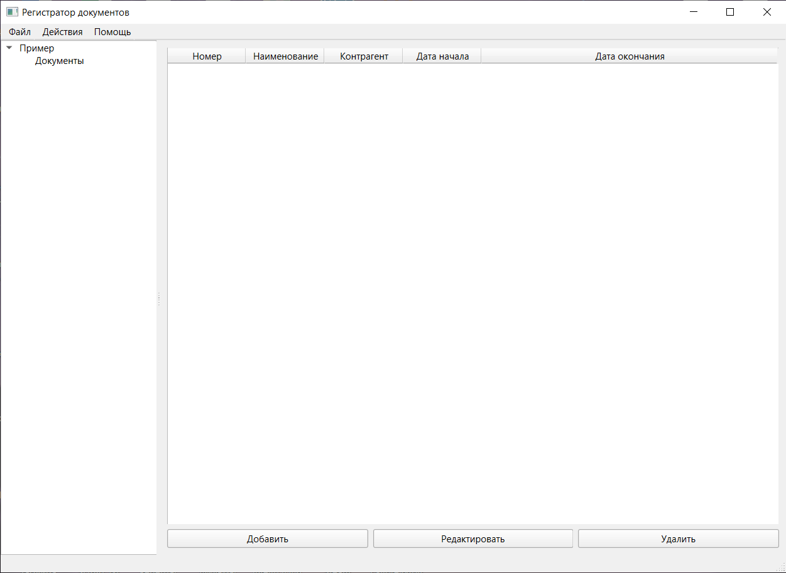

# Регистратор Документов

Программа для учета и управления документами.

## Скриншоты

> 

## Возможности

- **Двухуровневая система папок**:
  - Создание и удаление пользовательских "Верхних папок".
  - Создание и удаление пользовательских "Подпапок" внутри верхних.
  - Документы добавляются только в подпапки.
  
- **Управление документами**:
  - Добавление, редактирование, удаление и просмотр документов.
  - Поля документа: Номер, Наименование, Контрагент, Дата начала, Дата окончания, Описание.
  - Прикрепление локальных файлов к документам (с копированием в хранилище приложения).

- **Хранение данных**:
  - Данные сохраняются в локальной базе данных SQLite (`documents.db`).
  - Прикрепленные файлы копируются в папку `attachments` рядом с программой.

- **Поиск**:
  - Поиск документов по всем полям или по конкретному полю.
  - Поиск по диапазону дат.

- **Отслеживание сроков**:
  - Проверка договоров, истекающих в ближайшие N дней.
  - Визуальная подсветка истекающих договоров в таблице.

- **Экспорт**:
  - Экспорт содержимого выбранной подпапки в файл Excel (`.xlsx)

## Использование

**Начало работы:**
    - При первом запуске будет создана пустая база данных `documents.db` и папка `attachments`.
    - Пример начальной структуры ("Пример" -> "Документы") будет добавлен автоматически, если база данных пуста.
    - Используйте контекстное меню (правая кнопка мыши) в дереве папок слева для добавления новых верхних или подпапок.
    - Выберите подпапку, чтобы увидеть содержащиеся в ней документы.
    - Используйте кнопки "Добавить", "Редактировать", "Удалить" для управления документами внутри выбранной подпапки.

## Структура проекта

registrar/
├── main.py # Основной файл приложения
├── documents.db # Файл базы данных SQLite (создается при запуске)
├── attachments/ # Папка для хранения прикрепленных файлов (создается при запуске)
├── screenshots/ # Папка для скриншотов (для README)
│ └── main_window.png # Пример скриншота
├── README.md # Этот файл
└── requirements.txt # Файл зависимостей (см. ниже)

## Зависимости

- **Зависимости перечислены в файле `requirements.txt`**:
  - PySide6
  - pandas
  - openpyxl
  - shortuuid

## Лицензия

Этот проект лицензирован по своей лицензии - см. файл [LICENSE] для подробностей.

## Контакт

Иван Пожидаев[@firent] (<https://github.com/firent>) - <ivan@ivanpozhidaev.ru>

Ссылка на проект: [https://github.com/firent/registrar]
